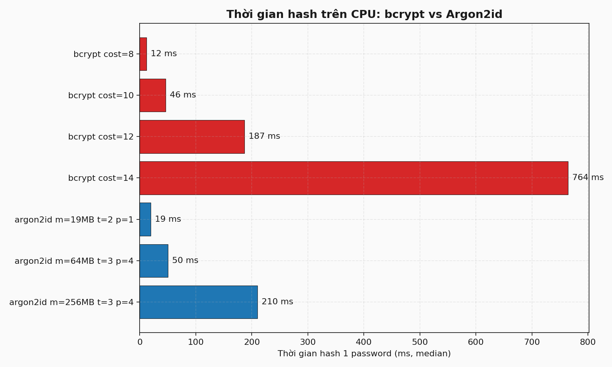
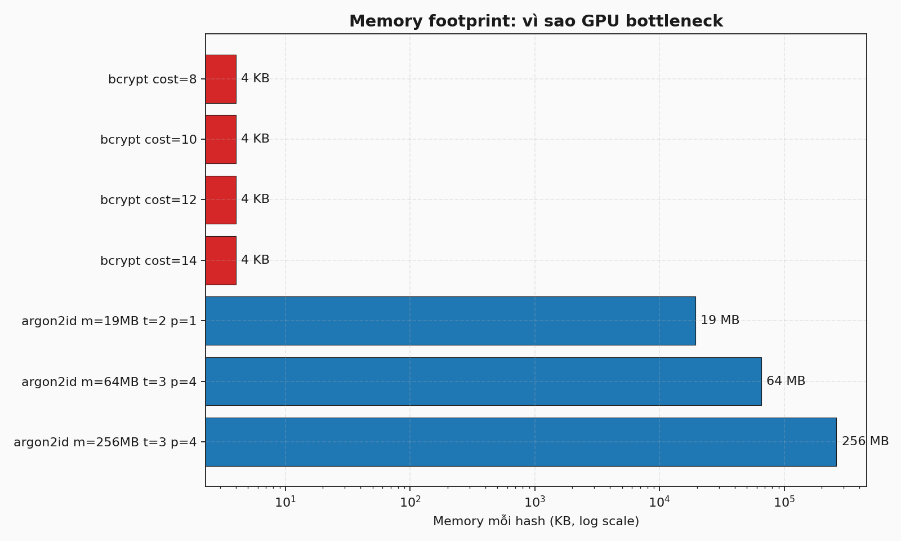
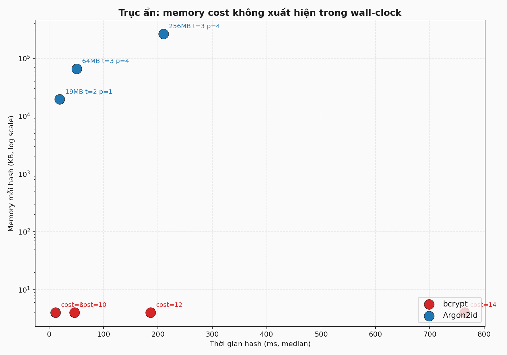

# bcrypt vs Argon2id: empirical CPU/GPU benchmark

Reproducible benchmark code measuring password hashing speed and GPU crack throughput for bcrypt and Argon2id. Companion code for the omelet.tech blog post: [bcrypt cost=12 mất 187ms để hash. GPU bẻ nó 95 lần nhanh hơn CPU. Argon2 thì khác](https://omelet.tech/).

## What this measures

**CPU side** (Docker, `benchmark.py`):

- Wall-clock time to hash one password across bcrypt cost factors 8/10/12/14
- Wall-clock time across Argon2id configurations: OWASP min (19 MiB), RFC 9106 second (64 MiB t=3 p=4), heavy (256 MiB t=3 p=4)
- 30 samples per config, p50 and p95 reported

**GPU side** (hashcat, `run-hashcat.sh`):

- Throughput in H/s for bcrypt at multiple cost factors using hashcat mode 3200
- Note that mainline hashcat does not support Argon2id (as of v7.0). The repo documents this and explains why.

## Quickstart

### CPU benchmark

```bash
bash run-native.sh
```

Installs `bcrypt`, `argon2-cffi`, `matplotlib`, `psutil` into the current Python environment if missing, runs the benchmark, then renders three PNG charts into `charts/`.

Docker alternative:

```bash
docker compose run --rm benchmark
```

### GPU benchmark (NVIDIA only)

Requires hashcat 6.2+ and a CUDA-capable GPU. WSL2 users need the Windows host NVIDIA driver with CUDA-on-WSL support.

```bash
bash run-hashcat.sh
```

For specific cost factor attack throughput rather than the default `-b` benchmark (which runs cost=5):

```bash
python3 generate-test-hashes.py
hashcat -m 3200 -a 3 hashes/bcrypt-cost12.txt '?l?l?l?l?l?l?l?l' --runtime 30
```

## Reference results

The `results/` folder contains output captured on:

- CPU: Intel Core i7-12700F, 64 GiB RAM, Python 3.13, bcrypt 4.3.0, argon2-cffi 25.1.0
- GPU: NVIDIA GeForce RTX 3070 Ti (8 GiB), hashcat v7.0.0, CUDA 13.1

### CPU (`results/cpu-results.json`)

| Config | p50 (ms) | Throughput (H/s) |
|---|---:|---:|
| bcrypt cost=8 | 11.94 | 83.8 |
| bcrypt cost=10 | 46.40 | 21.6 |
| bcrypt cost=12 | 186.74 | 5.4 |
| bcrypt cost=14 | 764.05 | 1.3 |
| argon2id m=19 MiB t=2 p=1 | 19.29 | 51.8 |
| argon2id m=64 MiB t=3 p=4 | 50.48 | 19.8 |
| argon2id m=256 MiB t=3 p=4 | 210.07 | 4.8 |

### GPU (`results/gpu-results.json`)

| Config | GPU H/s | CPU H/s (1 core) | Speedup |
|---|---:|---:|---:|
| bcrypt cost=8 | 8,168 | 83.8 | 97x |
| bcrypt cost=10 | 2,022 | 21.6 | 94x |
| bcrypt cost=12 | 507 | 5.4 | 95x |
| bcrypt cost=14 | 126 | 1.3 | 96x |
| Argon2id (any config) | not measurable in hashcat mainline | n/a | n/a |

GPU speedup is consistent at roughly 95x across bcrypt cost factors because bcrypt fits in 4 KiB and scales linearly with iteration count.

## Charts

`charts/cpu-speed.png`:



`charts/memory-footprint.png`:



`charts/speed-vs-memory.png`:



## Files

- `benchmark.py`: CPU benchmark, writes `results/cpu-results.json`
- `plot.py`: renders three PNG charts from `cpu-results.json`
- `generate-test-hashes.py`: produces hashcat-formatted test hashes plus plaintext for verification
- `run-hashcat.sh`: hashcat GPU benchmark wrapper (handles WSL2 `LD_LIBRARY_PATH`)
- `run-native.sh`: convenience runner that installs deps then runs benchmark+plot
- `Dockerfile` and `docker-compose.yml`: containerized CPU benchmark
- `requirements.txt`: pinned Python dependencies

## Why this exists

Most password-hashing comparisons cite published numbers or argue from spec. This repo lets you verify the claims yourself in under five minutes on your own hardware. The thesis is in the blog: bcrypt and Argon2id can produce the same CPU wall-clock time while attackers pay vastly different amounts to crack them. Memory is the hidden axis.

## License

MIT. Use freely.
